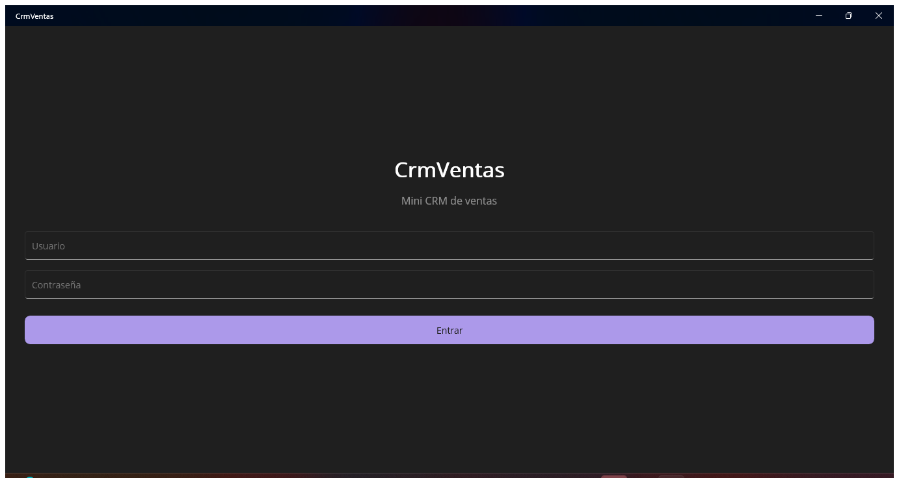

# CrmVentas

Mini CRM de ventas construido con **.NET 10**: una API REST (ASP.NET Core Web API + EF Core + SQL Server) y una app móvil en **.NET MAUI**, con clientes, catálogo de productos y pedidos con control de estado e inventario.



## Por qué este proyecto

Proyecto de portafolio que replica el stack con el que trabajo día a día: **C#, .NET, ASP.NET Web API, Entity Framework Core, SQL Server y .NET MAUI**, aplicando arquitectura en capas, MVVM, autenticación JWT y buenas prácticas de API REST.

## Funcionalidades

- **Autenticación** con JWT (login de usuario/contraseña con hashing BCrypt).
- **Clientes**: alta, edición, listado y baja.
- **Productos**: catálogo con SKU único, precio y stock.
- **Pedidos**: creación con múltiples productos, cálculo automático de total, descuento de stock al crear, y máquina de estados controlada en el backend:

  ```
  Pendiente → Confirmado → Enviado → Entregado
       ↓            ↓
   Cancelado   Cancelado
  ```

- Validaciones de negocio (stock insuficiente, transiciones de estado inválidas, SKU duplicado) devueltas como errores HTTP claros (400/404/401).
- App móvil en **.NET MAUI** (Android y Windows) con MVVM, consumiendo la API vía JWT.

## Arquitectura

Solución en capas:

```
CrmVentas.sln
├── src/
│   ├── CrmVentas.Domain          Entidades y enums, sin dependencias externas
│   ├── CrmVentas.Application     DTOs, interfaces, servicios con la lógica de negocio
│   ├── CrmVentas.Infrastructure  EF Core (DbContext, migraciones, repositorios), JWT, hashing
│   ├── CrmVentas.Api             ASP.NET Web API: controllers, Swagger, autenticación
│   └── CrmVentas.Mobile          App .NET MAUI (MVVM, CommunityToolkit.Mvvm)
├── tests/
│   └── CrmVentas.Application.Tests   Pruebas unitarias (xUnit + Moq) de la lógica de negocio
└── docker-compose.yml             SQL Server en contenedor (alternativa a LocalDB)
```


- **Usuario:** `admin`
- **Contraseña:** `Admin123!`

### 2. App móvil (.NET MAUI)

```bash
dotnet build src/CrmVentas.Mobile -f net10.0-windows10.0.19041.0   # Windows
dotnet build src/CrmVentas.Mobile -f net10.0-android               # Android
```

La app apunta a `http://localhost:5119` en Windows y a `http://10.0.2.2:5119` en el emulador de Android (ver [`AppConfig.cs`](src/CrmVentas.Mobile/Services/AppConfig.cs)).


## Decisiones técnicas

- **Sin ASP.NET Identity completo**: se usa una entidad `Usuario` simple + BCrypt para no sobre-diseñar la autenticación de un proyecto de este alcance, manteniendo JWT como mecanismo real de autorización.
- **Repository + Unit of Work**: cada agregado (`Cliente`, `Producto`, `Pedido`) tiene su propio repositorio; el guardado se centraliza en un `IUnitOfWork` para mantener las transacciones explícitas en la capa de aplicación.
- **Reglas de negocio en la capa Application**, no en los controllers ni en la base de datos: las validaciones de stock y transición de estados viven en `PedidoService`, con pruebas unitarias dedicadas.
- **CI solo compila el backend**: el workflow de GitHub Actions excluye `CrmVentas.Mobile` porque requiere los workloads de Android/Windows que no están disponibles por defecto en el runner; se puede extender con un runner `windows-latest` si se necesita cubrir también el móvil.

## Próximos pasos posibles

- Publicar la API en un servicio como Azure App Service o Railway para tener una demo pública.
- Agregar paginación y búsqueda en los listados.
- Agregar más pantallas a la app MAUI (reportes, dashboard).
